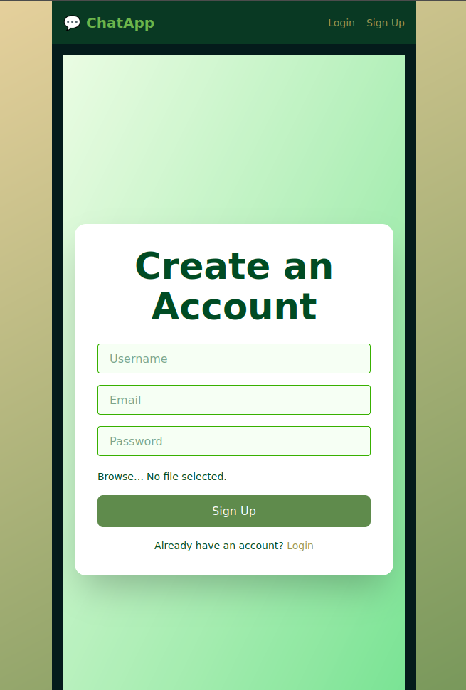
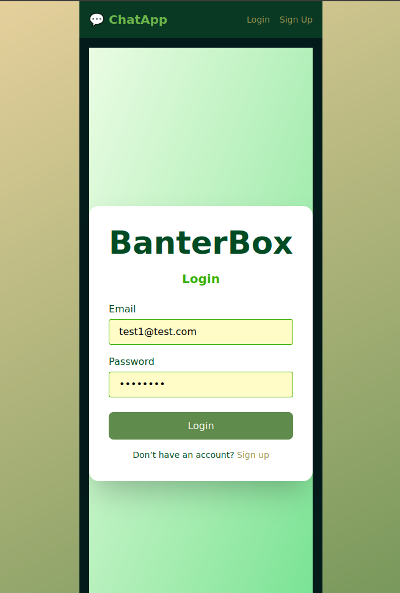
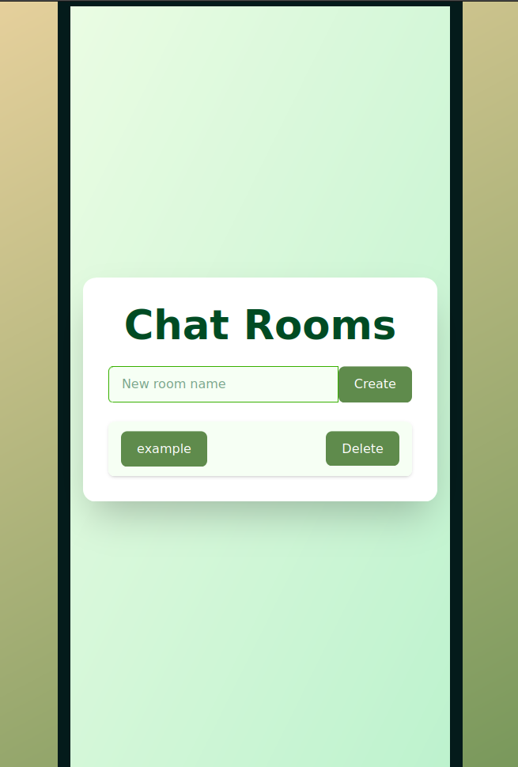
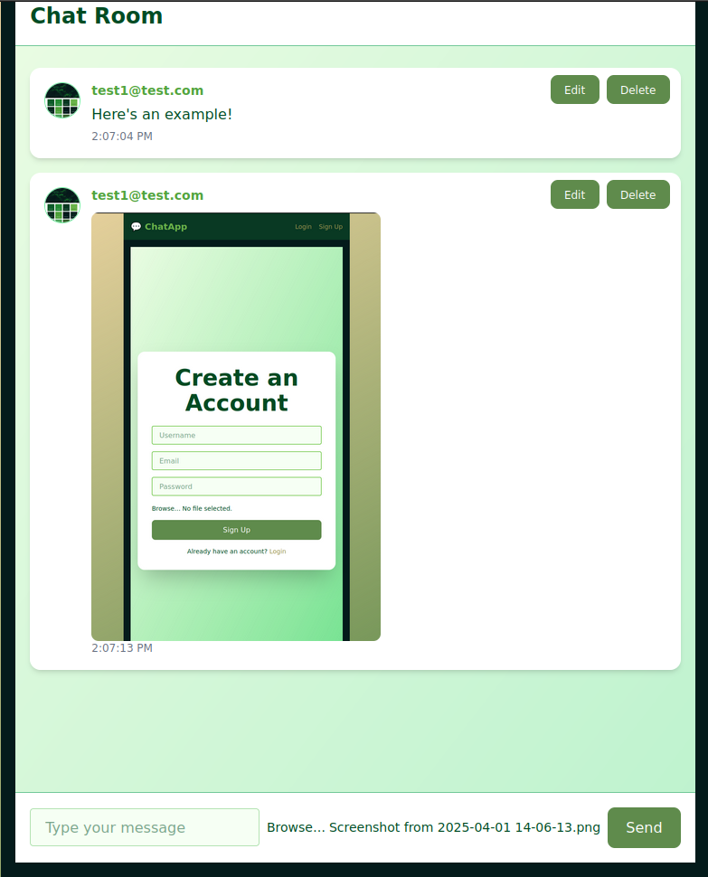

# BanterBox 

BanterBox is a full-stack real-time chat application built with **Ruby on Rails (API)** for the backend and **React + Tailwind CSS** for the frontend. Users can register, create chat rooms, send messages (text or images), and manage their profiles. This project supports JWT authentication and persistent sessions with a clean, responsive UI.

---

##  Features

- User authentication (Sign up / Login / Logout)
- JWT-based token storage with secure headers
- Persistent session via `localStorage`
- Real-time chat rooms with message history
- Image file support in chat
- Profile management with avatar uploads
- Fully responsive and mobile-friendly layout
- Unit and integration tests using Jest & React Testing Library

---

##  Technologies Used

### Frontend
- React 19
- Tailwind CSS 4.0
- React Router v7
- Axios for API requests
- Jest + React Testing Library for unit testing
- Vite for blazing fast builds and development

### Backend
- Ruby on Rails API mode
- Devise + JWT for authentication
- Active Storage for file uploads
- PostgreSQL database

---

##  Installation

### Prerequisites:
- Node.js & npm
- Ruby & Rails
- PostgreSQL

### Backend Setup:
```bash
git clone https://github.com/yourusername/chat-app-api.git
cd chat-app-api
bundle install
rails db:create db:migrate
rails s
```

### Frontend Setup:
```bash
git clone https://github.com/yourusername/chat-app-frontend.git
cd chat-app-frontend
npm install
npm run dev
```

---

##  Usage

1. Register an account or login
2. Create or join a chat room
3. Send messages or upload images
4. View or update your profile

---

##  Environment Variables
Create a `.env` file in the frontend root:
```bash
VITE_API_BASE_URL=http://localhost:3000
```

---

##  Running Tests
```bash
npm test
```
>tests for Login, Signup, NavBar, Profile, ChatRooms, and ChatRoom components.

---

##  Live Demo

👉 [Check out the deployed app here](https://your-live-site-url.com)

---

## 📸 Screenshots

| Signup Page | Login Page | ChatRooms Page | Chat Room ||
|-------------|------------|----------------|-----------|---------------|
|  |  |  |   |


##  Author
**(Austin Bakaric)**
- [LinkedIn](https://www.linkedin.com/in/austin-bakaric-891994353/)

---


## Acknowledgments
- The Odin Project for initial guidance
- Tailwind UI inspiration
- JSDOM & React Testing Library contributors

